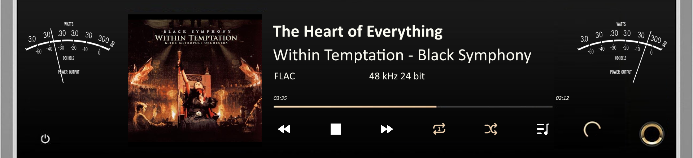
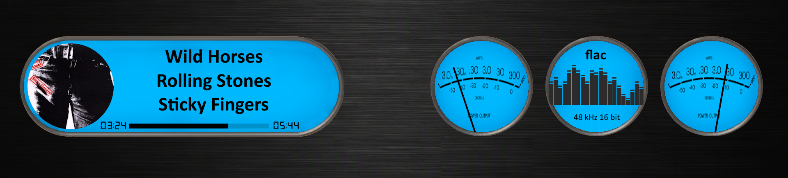
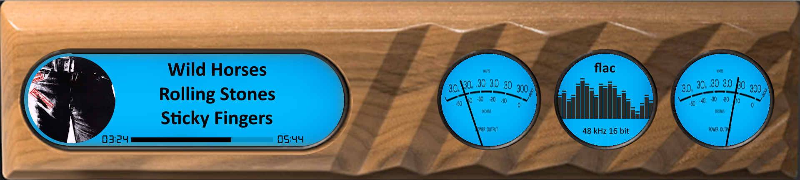
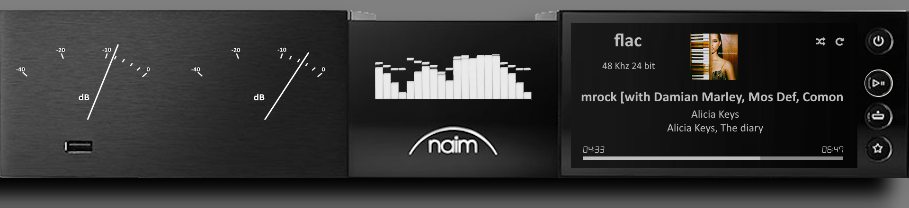
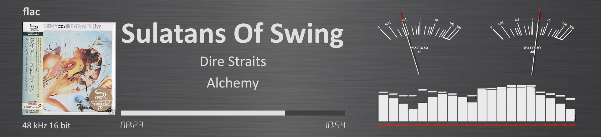
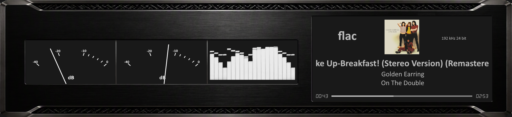

# 1920x440 Templates

All templates available for 1920x440 resolution.

---

## 1920x440_Aluminium_01

**Type:** VU Meter

**Meter:** Aluminium_01

**Download:** [1920x440_Aluminium_01.zip](../template_peppy/1920/440/1920x440_Aluminium_01.zip)

**Install:** Extract and copy folder to `/data/INTERNAL/peppy_screensaver/templates/`

---

## 1920x440_Aureon

**Type:** VU Meter

**Meter:** Aureon

**Download:** [1920x440_Aureon.zip](../template_peppy/1920/440/1920x440_Aureon.zip)

**Install:** Extract and copy folder to `/data/INTERNAL/peppy_screensaver/templates/`

---

## 1920x440_Carbon_Black

**Type:** VU Meter

**Meter:** Carbon_Black

**Download:** [1920x440_Carbon_Black.zip](../template_peppy/1920/440/1920x440_Carbon_Black.zip)

**Install:** Extract and copy folder to `/data/INTERNAL/peppy_screensaver/templates/`

---

## 1920x440_Matrix_TS1

**Type:** VU Meter

**Meter:** Matrix_TS1

**Download:** [1920x440_Matrix_TS1.zip](../template_peppy/1920/440/1920x440_Matrix_TS1.zip)

**Install:** Extract and copy folder to `/data/INTERNAL/peppy_screensaver/templates/`

---

## 1920x440_Rega_Planar_8

**Type:** VU Meter

**Meter:** Rega_Planar_8

**Download:** [1920x440_Rega_Planar_8.zip](../template_peppy/1920/440/1920x440_Rega_Planar_8.zip)

**Install:** Extract and copy folder to `/data/INTERNAL/peppy_screensaver/templates/`

---

## 1920x440_Rose_RS451

**Type:** VU Meter

**Meter:** Rose_RS451

**Download:** [1920x440_Rose_RS451.zip](../template_peppy/1920/440/1920x440_Rose_RS451.zip)

**Install:** Extract and copy folder to `/data/INTERNAL/peppy_screensaver/templates/`

---

## 1920x440_Aluminium_spectrum

**Type:** Combined

**Meter:** Aluminium_spectrum

**Download:** [1920x440_Aluminium_spectrum.zip](../templates_peppy_spectrum/1920/440/1920x440_Aluminium_spectrum.zip)

**Install (both required):**
1. Extract the zip file
2. Copy `templates/1920x440_Aluminium_spectrum/` to `/data/INTERNAL/peppy_screensaver/templates/`
3. Copy `templates_spectrum/1920x440_Aluminium_spectrum/` to `/data/INTERNAL/peppy_screensaver/templates_spectrum/`

---

## 1920x440_Black_Blue

**Type:** Combined

**Meter:** Black_Blue_spectrum

**Download:** [1920x440_Black_Blue.zip](../templates_peppy_spectrum/1920/440/1920x440_Black_Blue.zip)

**Install (both required):**
1. Extract the zip file
2. Copy `templates/1920x440_Black_Blue/` to `/data/INTERNAL/peppy_screensaver/templates/`
3. Copy `templates_spectrum/1920x440_Black_Blue/` to `/data/INTERNAL/peppy_screensaver/templates_spectrum/`

---

## 1920x440_Flow_Two

**Type:** Combined

**Meter:** Flow_Two

**Download:** [1920x440_Flow_Two.zip](../templates_peppy_spectrum/1920/440/1920x440_Flow_Two.zip)

**Install (both required):**
1. Extract the zip file
2. Copy `templates/1920x440_Flow_Two/` to `/data/INTERNAL/peppy_screensaver/templates/`
3. Copy `templates_spectrum/1920x440_Flow_Two/` to `/data/INTERNAL/peppy_screensaver/templates_spectrum/`

---

## 1920x440_Naim_NSS-333

**Type:** Combined

**Meter:** Naim_NSS-333

**Download:** [1920x440_Naim_NSS-333.zip](../templates_peppy_spectrum/1920/440/1920x440_Naim_NSS-333.zip)

**Install (both required):**
1. Extract the zip file
2. Copy `templates/1920x440_Naim_NSS-333/` to `/data/INTERNAL/peppy_screensaver/templates/`
3. Copy `templates_spectrum/1920x440_Naim_NSS-333/` to `/data/INTERNAL/peppy_screensaver/templates_spectrum/`

---

## 1920x440_Titanium_Black

**Type:** Combined

**Meter:** Titanium_Black

**Download:** [1920x440_Titanium_Black.zip](../templates_peppy_spectrum/1920/440/1920x440_Titanium_Black.zip)

**Install (both required):**
1. Extract the zip file
2. Copy `templates/1920x440_Titanium_Black/` to `/data/INTERNAL/peppy_screensaver/templates/`
3. Copy `templates_spectrum/1920x440_Titanium_Black/` to `/data/INTERNAL/peppy_screensaver/templates_spectrum/`

---

## 1920x440_black-anodized

**Type:** Combined

**Meter:** Black-Anodized

**Download:** [1920x440_black-anodized.zip](../templates_peppy_spectrum/1920/440/1920x440_black-anodized.zip)

**Install (both required):**
1. Extract the zip file
2. Copy `templates/1920x440_black-anodized/` to `/data/INTERNAL/peppy_screensaver/templates/`
3. Copy `templates_spectrum/1920x440_black-anodized/` to `/data/INTERNAL/peppy_screensaver/templates_spectrum/`

---

