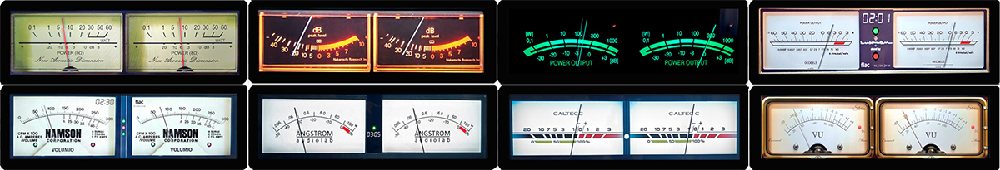

# 1920x480 Templates

All templates available for 1920x480 resolution.

---

## 1920x480_30g5_810

**Type:** VU Meter

**Included Meters (30):**

- 01G5_Naim
- 02G5_McIntosh C12000
- 03G5_Accuphase E8000 Led
- 04G5_Brianworks
- 05G5_Advanced X220
- 06G5_Old Meter
- 07G5_NAD C3050
- 08G5_Hitachi HMA7500
- 09G5_Kenwood Rev
- 10G5_Accuphase Rev
- 11G5_Accuphase
- 12G5_Luxman
- 13G5_BlackBlur
- 14G5_Turntable Black
- 15G5_Sansui Vertical
- 16G5_Sansui Horizontal
- 17G5_Sleepy
- 18G5_Dorrough
- 19G5_Kruger&Matz
- 20G5_Dagostino
- 21G5_Technics Silver
- 22G5_Technics Black
- 23G5_Technics Gold
- 24G5_Marantz CD
- 25G5_Led Strips
- 26G5_Casette Full
- 27G5_Saba
- 28G5_Furex
- 29G5_Loudspeaker_OUT
- 30G5_Eher

**Download:** [1920x480_30g5_810.zip](../template_peppy/1920/480/1920x480_30g5_810.zip)

**Install:** Extract and copy the folder to `/data/INTERNAL/glass/templates/` on Glass, or to `/data/INTERNAL/peppy_screensaver/templates/` on PeppyMeter Screensaver (legacy)

---

## 1920x480_g5_811_meters

**Type:** VU Meter

**Included Meters (9):**

- 101G5_Turntable Black
- 102G5_Ampex Reel
- 103G5_Pioneer Gold
- 104G5_CD Player Full
- 105G5_Yamaha Cassette
- 106G5_Otari Reel
- 107G5_TDK Reel
- 108G5_Akai 77
- 109G5_Cassette_Linear

**Download:** [1920x480_g5_811_meters.zip](../template_peppy/1920/480/1920x480_g5_811_meters.zip)

**Install:** Extract and copy the folder to `/data/INTERNAL/glass/templates/` on Glass, or to `/data/INTERNAL/peppy_screensaver/templates/` on PeppyMeter Screensaver (legacy)

---

## 1920x480_g5_820_basic

**Type:** VU Meter

**Included Meters (8):**

- 31G5_NAD only meters
- 32G5_Nakamichi only meters
- 33G5_DF202 Only meters
- 34G5_T+A
- 35G5_Luxman ONLY
- 36G5_Namson Only
- 37G5_Angstrom only
- 38G5_Caltecc ony meters

**Download:** [1920x480_g5_820_basic.zip](../template_peppy/1920/480/1920x480_g5_820_basic.zip)

**Install:** Extract and copy the folder to `/data/INTERNAL/glass/templates/` on Glass, or to `/data/INTERNAL/peppy_screensaver/templates/` on PeppyMeter Screensaver (legacy)

---

## 1920x480_g5_850_sm

**Type:** Combined

**Included Meters (6):**

- 40G5_Kenwood Spectrum
- 41G5_OldPipe S+M
- 42G5_Accuphase DG68 S+M
- 43G5_Marschal Spectrum
- 44G5_Caltecc_S+M
- 45G5_Free S+M

**Download:** [1920x480_g5_850_sm.zip](../templates_peppy_spectrum/1920/480/1920x480_g5_850_sm.zip)

**Install on Glass (both required):**
1. Extract the zip file
2. Copy `templates/1920x480_g5_850_sm/` to `/data/INTERNAL/glass/templates/`
3. Copy `templates_spectrum/1920x480_g5_850_sm/` to `/data/INTERNAL/glass/templates_spectrum/`

Or press Install on the Catalog tab of the Glass Manager.

**Install on PeppyMeter Screensaver, legacy (both required):**
1. Extract the zip file
2. Copy `templates/1920x480_g5_850_sm/` to `/data/INTERNAL/peppy_screensaver/templates/`
3. Copy `templates_spectrum/1920x480_g5_850_sm/` to `/data/INTERNAL/peppy_screensaver/templates_spectrum/`

---

## 1920x480_gradients_kcaudio

**Type:** Spectrum

**Included Meters (12):**

- kcaudio_1920_green_blue
- kcaudio_1920_purple_pink
- kcaudio_1920_sunset
- kcaudio_1920_cyan_magenta
- kcaudio_1920_teal_lime
- kcaudio_1920_red_gold
- kcaudio_1920_night_sky
- kcaudio_1920_neon_violet
- kcaudio_1920_mint_sunset
- kcaudio_1920_coral_aqua
- kcaudio_1920_rainbow
- kcaudio_1920_rainbow_reverse

**Download:** [1920x480_gradients_kcaudio.zip](../templates_spectrum/1920/480/1920x480_gradients_kcaudio.zip)

**Install:** Extract and copy the folder to `/data/INTERNAL/glass/templates_spectrum/` on Glass, or to `/data/INTERNAL/peppy_screensaver/templates_spectrum/` on PeppyMeter Screensaver (legacy)

---

