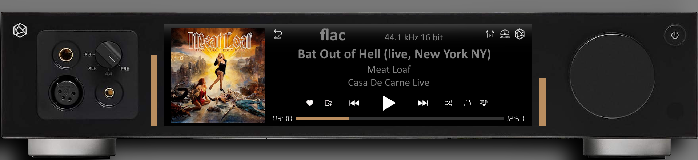

# 440 Templates

VU Meter templates for PeppyMeter Screensaver.

---

## 1920x440_Aluminium_01

| Property | Value |
|----------|-------|
| Meter Name | Aluminium_01 |
| Meter Type | circular |
| Extended Config | Yes |
| Spectrum | No |
| Album Art | Yes |

**Download:** [1920x440_Aluminium_01.zip](1920x440_Aluminium_01.zip)

**Install:** Extract and copy folder to `/data/INTERNAL/peppy_screensaver/templates/`

---

## 1920x440_Aureon

| Property | Value |
|----------|-------|
| Meter Name | Aureon |
| Meter Type | circular |
| Extended Config | Yes |
| Spectrum | No |
| Album Art | Yes |

**Download:** [1920x440_Aureon.zip](1920x440_Aureon.zip)

**Install:** Extract and copy folder to `/data/INTERNAL/peppy_screensaver/templates/`

---

## 1920x440_Carbon_Black

| Property | Value |
|----------|-------|
| Meter Name | Carbon_Black |
| Meter Type | circular |
| Extended Config | Yes |
| Spectrum | No |
| Album Art | Yes |

**Download:** [1920x440_Carbon_Black.zip](1920x440_Carbon_Black.zip)

**Install:** Extract and copy folder to `/data/INTERNAL/peppy_screensaver/templates/`

---

## 1920x440_Naim_NSS-333

| Property | Value |
|----------|-------|
| Meter Name | Naim_NSS-333 |
| Meter Type | circular |
| Extended Config | Yes |
| Spectrum | Yes |
| Album Art | Yes |

**Download:** [1920x440_Naim_NSS-333.zip](1920x440_Naim_NSS-333.zip)

**Install:** Extract and copy folder to `/data/INTERNAL/peppy_screensaver/templates/`

---

## 1920x440_Rega_Planar_8

| Property | Value |
|----------|-------|
| Meter Name | Rega_Planar_8 |
| Meter Type | linear |
| Extended Config | Yes |
| Spectrum | No |
| Album Art | Yes |

**Download:** [1920x440_Rega_Planar_8.zip](1920x440_Rega_Planar_8.zip)

**Install:** Extract and copy folder to `/data/INTERNAL/peppy_screensaver/templates/`

---

## 1920x440_Rose_RS451

| Property | Value |
|----------|-------|
| Meter Name | Rose_RS451 |
| Meter Type | linear |
| Extended Config | Yes |
| Spectrum | No |
| Album Art | Yes |

**Download:** [1920x440_Rose_RS451.zip](1920x440_Rose_RS451.zip)

**Install:** Extract and copy folder to `/data/INTERNAL/peppy_screensaver/templates/`

---

## Installation

1. Download the desired template zip(s)
2. Extract each to the path shown next to its download link
3. Select in plugin settings

---

*Part of [PeppyMeter Templates](https://github.com/foonerd/peppy_templates)*
