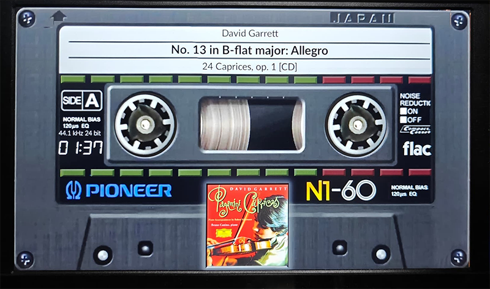

# 2160 Templates

Meter themes.

---

## 3840x2160_140g5_casette_780

| Property | Value |
|----------|-------|
| Meter Name | 140G5_Full_Cassette |
| Meter Type | linear |
| Extended Config | Yes |
| Spectrum | No |
| Album Art | Yes |

**Download:** [3840x2160_140g5_casette_780.zip](3840x2160_140g5_casette_780.zip)

**Install:** Extract and copy the folder to `/data/INTERNAL/glass/templates/`

---

## Installation

1. Download the desired template zip(s)
2. Extract each to the path shown next to its download link
3. Choose it on the Themes tab of the Glass Manager

---

*Part of the [Glass theme collection](https://github.com/foonerd/peppy_templates)*
