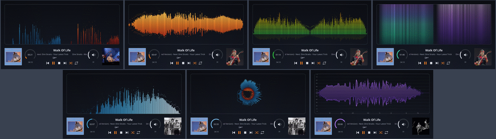
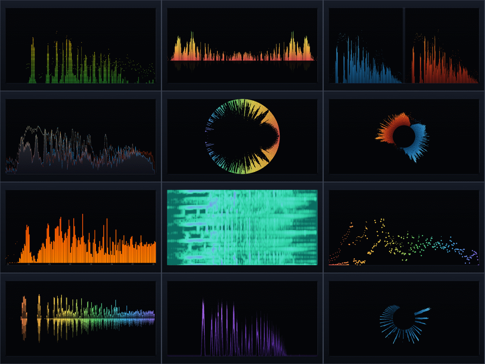

# 720 Templates

Combined VU Meter + Spectrum templates (self-contained with both parts).

---

## 1280x720_g5_450_sm

| Property | Value |
|----------|-------|
| Template Pack | Yes (6 templates) |
| Meter Type | circular |
| Extended Config | Yes |
| Spectrum | Yes |
| Album Art | Yes |

**Included Meters:**

- 101G5_Lyngdorf S+M
- 102G5_Naim S+M
- 103G5_Teletronix S+M
- 104G5_Old Spectrum S+M
- 105G5_Marantz S+M
- 106G5_Kenwood Spectrum

**Download:** [1280x720_g5_450_sm.zip](1280x720_g5_450_sm.zip)

**Install on Glass (both required):**
1. Extract the zip file
2. Copy `templates/` contents to `/data/INTERNAL/glass/templates/`
3. Copy `templates_spectrum/` contents to `/data/INTERNAL/glass/templates_spectrum/`

Or press Install on the Catalog tab of the Glass Manager.

**Install on PeppyMeter Screensaver, legacy (both required):**
1. Extract the zip file
2. Copy `templates/` contents to `/data/INTERNAL/peppy_screensaver/templates/`
3. Copy `templates_spectrum/` contents to `/data/INTERNAL/peppy_screensaver/templates_spectrum/`

---

## 1280x720_g5_451_ms

| Property | Value |
|----------|-------|
| Meter Name | 107G5_Pioneer S+M |
| Meter Type | circular |
| Extended Config | Yes |
| Spectrum | Yes |
| Album Art | Yes |

**Download:** [1280x720_g5_451_ms.zip](1280x720_g5_451_ms.zip)

**Install on Glass (both required):**
1. Extract the zip file
2. Copy `templates/` contents to `/data/INTERNAL/glass/templates/`
3. Copy `templates_spectrum/` contents to `/data/INTERNAL/glass/templates_spectrum/`

Or press Install on the Catalog tab of the Glass Manager.

**Install on PeppyMeter Screensaver, legacy (both required):**
1. Extract the zip file
2. Copy `templates/` contents to `/data/INTERNAL/peppy_screensaver/templates/`
3. Copy `templates_spectrum/` contents to `/data/INTERNAL/peppy_screensaver/templates_spectrum/`

---

## 1280x720_glass_analyser

| Property | Value |
|----------|-------|
| Template Pack | Yes (6 templates) |
| Meter Type | linear |
| Extended Config | Yes |
| Spectrum | Yes |
| Album Art | Yes |

**Included Meters:**

- studio
- lamps
- glow
- wire
- orbit
- trace

**Download:** [1280x720_glass_analyser.zip](1280x720_glass_analyser.zip)

**Install on Glass (both required):**
1. Extract the zip file
2. Copy `templates/` contents to `/data/INTERNAL/glass/templates/`
3. Copy `templates_spectrum/` contents to `/data/INTERNAL/glass/templates_spectrum/`

Or press Install on the Catalog tab of the Glass Manager.

**Install on PeppyMeter Screensaver, legacy (both required):**
1. Extract the zip file
2. Copy `templates/` contents to `/data/INTERNAL/peppy_screensaver/templates/`
3. Copy `templates_spectrum/` contents to `/data/INTERNAL/peppy_screensaver/templates_spectrum/`

---

## 1280x720_glass_looks

| Property | Value |
|----------|-------|
| Template Pack | Yes (28 templates) |
| Meter Type | linear |
| Extended Config | Yes |
| Spectrum | Yes |
| Album Art | No |

**Included Meters:**

- bars-plain
- bars-rounded
- bars-led
- bars-lumi
- bars-outline
- bars-mirror-reflex
- bars-stereo-split
- bars-sides
- graph-fill
- graph-line-peaks
- radial-out
- radial-invert-spin
- radial-halves
- scales-hertz
- scales-notes
- palette-own-stops
- color-by-level
- level-linear
- onset-flash
- onset-ring
- dots
- waterfall
- waterfall-sides
- trail
- glow
- fluid
- ribbon
- echo

**Download:** [1280x720_glass_looks.zip](1280x720_glass_looks.zip)

**Install on Glass (both required):**
1. Extract the zip file
2. Copy `templates/` contents to `/data/INTERNAL/glass/templates/`
3. Copy `templates_spectrum/` contents to `/data/INTERNAL/glass/templates_spectrum/`

Or press Install on the Catalog tab of the Glass Manager.

**Install on PeppyMeter Screensaver, legacy (both required):**
1. Extract the zip file
2. Copy `templates/` contents to `/data/INTERNAL/peppy_screensaver/templates/`
3. Copy `templates_spectrum/` contents to `/data/INTERNAL/peppy_screensaver/templates_spectrum/`

---

## Installation

1. Download the desired template zip(s)
2. Extract each to the path shown next to its download link
3. Select in plugin settings

---

*Part of [PeppyMeter Templates](https://github.com/foonerd/peppy_templates)*
