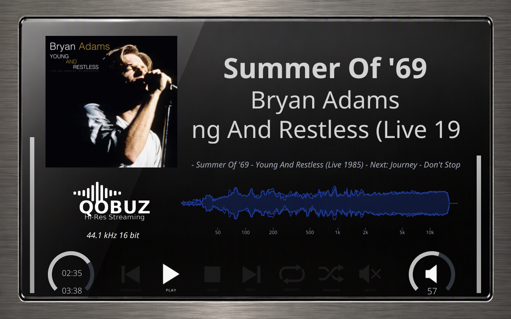
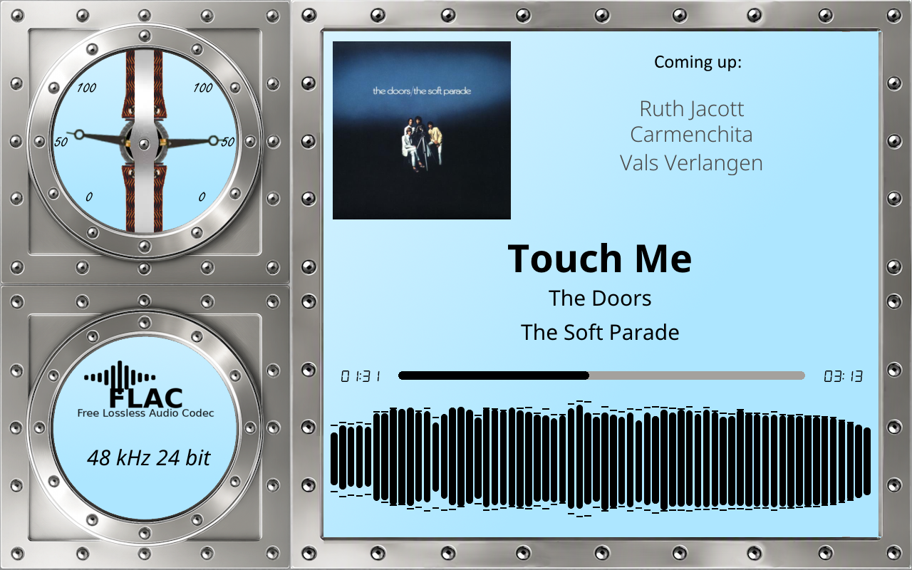
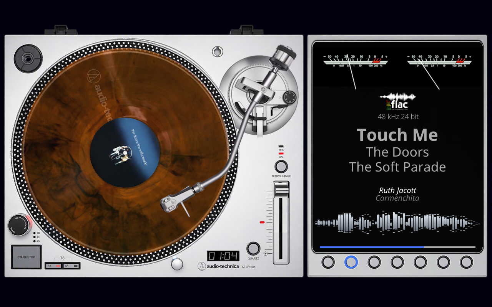
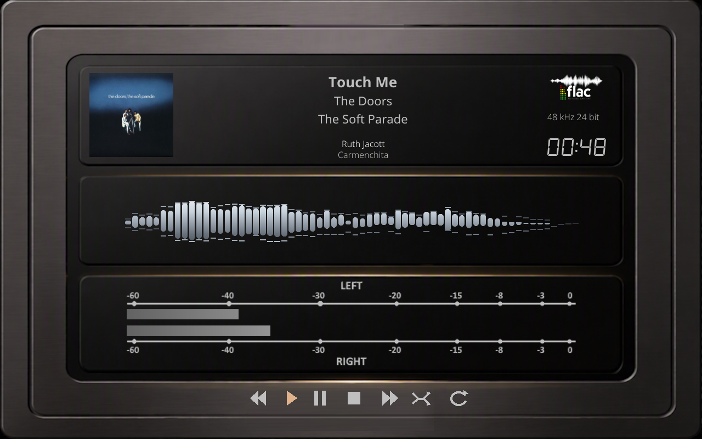
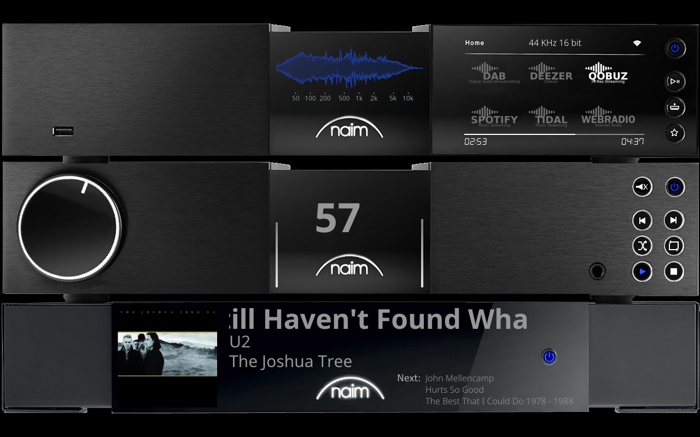
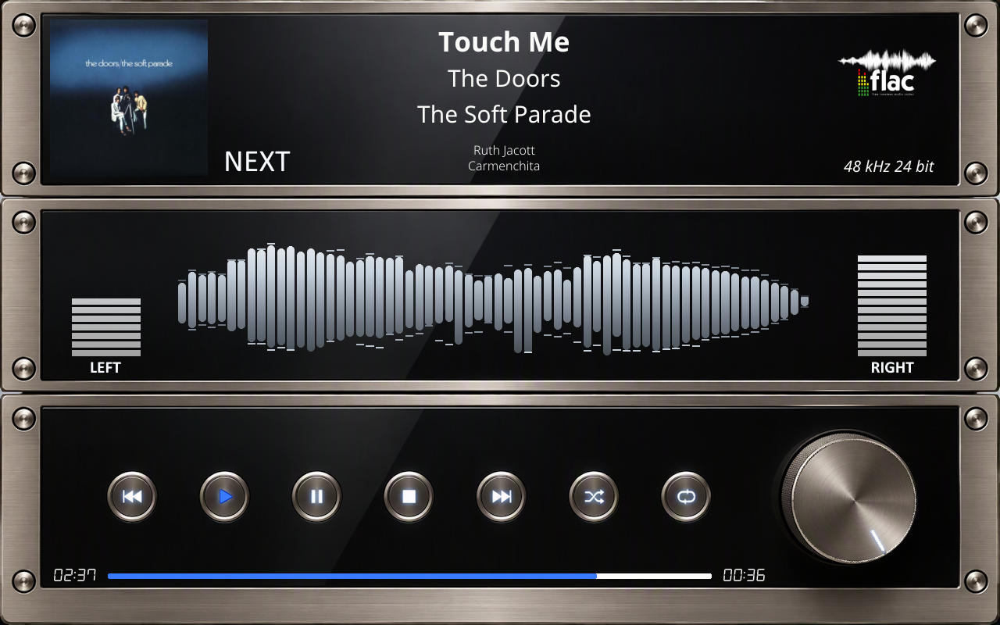
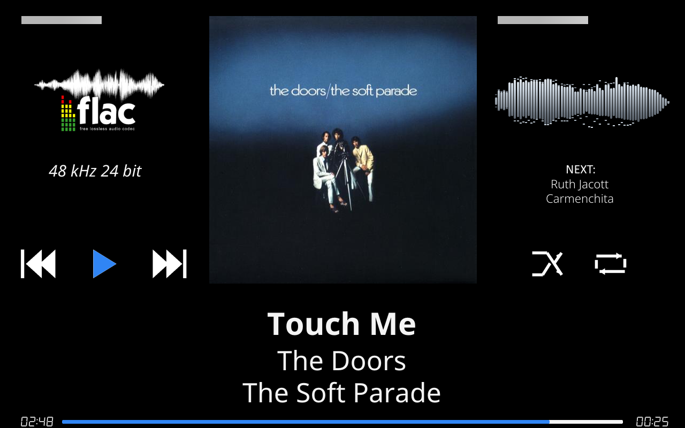

# 800 Templates

Combined VU Meter + Spectrum templates (self-contained with both parts).

---

## 1280x800_Alu_Glass

| Property | Value |
|----------|-------|
| Meter Name | Alu_Glass |
| Meter Type | linear |
| Extended Config | Yes |
| Spectrum | Yes |
| Album Art | Yes |

**Download:** [1280x800_Alu_Glass.zip](1280x800_Alu_Glass.zip)

**Uses the spectrum analyser, interactive buttons, Glass-only meter keys.**

**Install (both required):**
1. Extract the zip file
2. Copy `templates/` contents to `/data/INTERNAL/glass/templates/`
3. Copy `templates_spectrum/` contents to `/data/INTERNAL/glass/templates_spectrum/`

Or press Install on the Catalog tab of the Glass Manager.

---

## 1280x800_Aluminium_spectrum

| Property | Value |
|----------|-------|
| Meter Name | Aluminium_spectrum |
| Meter Type | circular |
| Extended Config | Yes |
| Spectrum | Yes |
| Album Art | Yes |

**Download:** [1280x800_Aluminium_spectrum.zip](1280x800_Aluminium_spectrum.zip)

**Uses the spectrum analyser.**

**Install (both required):**
1. Extract the zip file
2. Copy `templates/` contents to `/data/INTERNAL/glass/templates/`
3. Copy `templates_spectrum/` contents to `/data/INTERNAL/glass/templates_spectrum/`

Or press Install on the Catalog tab of the Glass Manager.

---

## 1280x800_Audio-Technica-LP120XSV

| Property | Value |
|----------|-------|
| Meter Name | LP120XSV |
| Meter Type | circular |
| Extended Config | Yes |
| Spectrum | Yes |
| Album Art | Yes |

**Download:** [1280x800_Audio-Technica-LP120XSV.zip](1280x800_Audio-Technica-LP120XSV.zip)

**Uses the spectrum analyser, interactive buttons.**

**Install (both required):**
1. Extract the zip file
2. Copy `templates/` contents to `/data/INTERNAL/glass/templates/`
3. Copy `templates_spectrum/` contents to `/data/INTERNAL/glass/templates_spectrum/`

Or press Install on the Catalog tab of the Glass Manager.

---

## 1280x800_Aureon

| Property | Value |
|----------|-------|
| Meter Name | Aureon-Bar |
| Meter Type | linear |
| Extended Config | Yes |
| Spectrum | Yes |
| Album Art | Yes |

**Download:** [1280x800_Aureon.zip](1280x800_Aureon.zip)

**Uses the spectrum analyser, interactive buttons.**

**Install (both required):**
1. Extract the zip file
2. Copy `templates/` contents to `/data/INTERNAL/glass/templates/`
3. Copy `templates_spectrum/` contents to `/data/INTERNAL/glass/templates_spectrum/`

Or press Install on the Catalog tab of the Glass Manager.

---

## 1280x800_Naim_NAC_332

| Property | Value |
|----------|-------|
| Meter Name | Naim_NAC 332 |
| Meter Type | linear |
| Extended Config | Yes |
| Spectrum | Yes |
| Album Art | Yes |

**Download:** [1280x800_Naim_NAC_332.zip](1280x800_Naim_NAC_332.zip)

**Uses the spectrum analyser, interactive buttons, Glass-only meter keys.**

**Install (both required):**
1. Extract the zip file
2. Copy `templates/` contents to `/data/INTERNAL/glass/templates/`
3. Copy `templates_spectrum/` contents to `/data/INTERNAL/glass/templates_spectrum/`

Or press Install on the Catalog tab of the Glass Manager.

---

## 1280x800_Titanium

| Property | Value |
|----------|-------|
| Meter Name | Titanium |
| Meter Type | linear |
| Extended Config | Yes |
| Spectrum | Yes |
| Album Art | Yes |

**Download:** [1280x800_Titanium.zip](1280x800_Titanium.zip)

**Uses the spectrum analyser, interactive buttons.**

**Install (both required):**
1. Extract the zip file
2. Copy `templates/` contents to `/data/INTERNAL/glass/templates/`
3. Copy `templates_spectrum/` contents to `/data/INTERNAL/glass/templates_spectrum/`

Or press Install on the Catalog tab of the Glass Manager.

---

## 1280x800_g5_410_ms

| Property | Value |
|----------|-------|
| Template Pack | Yes (13 templates) |
| Meter Type | circular |
| Extended Config | Yes |
| Spectrum | Yes |
| Album Art | Yes |

**Included Meters:**

- 101G5_Free S+M
- 102G5_Naim S+M
- 103G5_Marschal Spectrum
- 104G5_Lyngdorf S+M
- 105G5_Kenwood Spectrum
- 106G5_OldPipe Spectrum
- 107G5_Marantz S+M
- 108G5_Kenwood Rev S+M
- 109G5_475A Oscil S+M
- 110G5_PeppyP S+M
- 111G5_Teletronix S+M
- 112G5_KeySlight S+M
- 113G5_Old Spectrum S+M

**Download:** [1280x800_g5_410_ms.zip](1280x800_g5_410_ms.zip)

**Install (both required):**
1. Extract the zip file
2. Copy `templates/` contents to `/data/INTERNAL/glass/templates/`
3. Copy `templates_spectrum/` contents to `/data/INTERNAL/glass/templates_spectrum/`

Or press Install on the Catalog tab of the Glass Manager.

---

## 1280x800_standard

| Property | Value |
|----------|-------|
| Meter Name | Standard |
| Meter Type | linear |
| Extended Config | Yes |
| Spectrum | Yes |
| Album Art | Yes |

**Download:** [1280x800_standard.zip](1280x800_standard.zip)

**Uses the spectrum analyser, interactive buttons.**

**Install (both required):**
1. Extract the zip file
2. Copy `templates/` contents to `/data/INTERNAL/glass/templates/`
3. Copy `templates_spectrum/` contents to `/data/INTERNAL/glass/templates_spectrum/`

Or press Install on the Catalog tab of the Glass Manager.

---

## Installation

1. Download the desired template zip(s)
2. Extract each to the path shown next to its download link
3. Choose it on the Themes tab of the Glass Manager

---

*Part of the [Glass theme collection](https://github.com/foonerd/glass_templates)*
