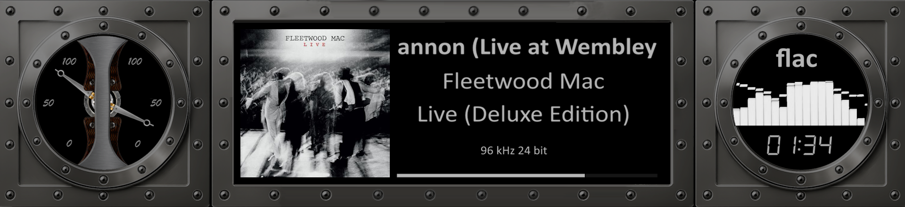

# 440 Templates

Combined VU Meter + Spectrum templates (self-contained with both parts).

---

## 1920x440_Aluminium_spectrum

| Property | Value |
|----------|-------|
| Meter Name | Aluminium_spectrum |
| Meter Type | circular |
| Extended Config | Yes |
| Spectrum | Yes |
| Album Art | Yes |

**Download:** [1920x440_Aluminium_spectrum.zip](1920x440_Aluminium_spectrum.zip)

**Install (both required):**
1. Extract the zip file
2. Copy `templates/` contents to `/data/INTERNAL/peppy_screensaver/templates/`
3. Copy `templates_spectrum/` contents to `/data/INTERNAL/peppy_screensaver/templates_spectrum/`

---

## Installation

1. Download the desired template zip(s)
2. Extract each to the path shown next to its download link
3. Select in plugin settings

---

*Part of [PeppyMeter Templates](https://github.com/foonerd/peppy_templates)*
